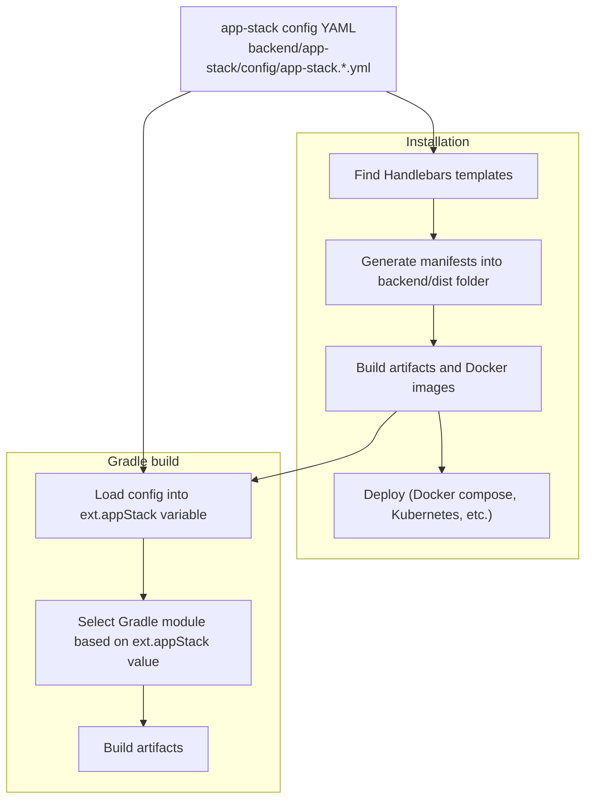
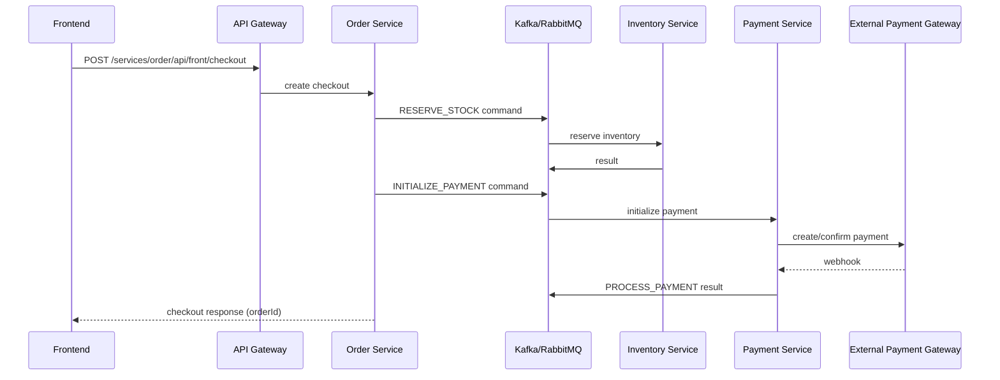

# Atlas

[](https://openjdk.org/)
[](https://spring.io/projects/spring-boot)
[](https://spring.io/projects/spring-cloud)
[](https://gradle.org/)
[](https://docs.docker.com/compose/)
[](https://kubernetes.io/)
[](https://nextjs.org/)
[](https://react.dev/)
[](https://www.typescriptlang.org/)

## Project Overview

Atlas is a modular e-commerce microservices system that demonstrates **DDD + Hexagonal Architecture** with a configurable **app-stack** mechanism.

Each business service follows this structure:

- `domain`: core business models and rules
- `port`: inbound/outbound contracts
- `application`: use cases and orchestration logic
- `api`: REST/gRPC transport layer
- `infrastructure`: adapters (database, messaging, external providers, file/search/storage)
- `bootstrap`: runtime assembly and Spring Boot startup

Shared backend capabilities are implemented as reusable Gradle modules under `backend/libs/` and selected at build time from app-stack configuration.

## Technology Stack

### Backend

- **Core**: Java 17, Spring Boot 4.0.3, Spring Cloud 2025.1.0.
- **API & Communication**: REST, gRPC, OpenAPI, Spring Cloud Gateway Reactive.
- **Security**: Spring Security, JWT, OAuth2, Keycloak.
- **Data & Infra**: MySQL, PostgreSQL, Redis, Kafka, RabbitMQ, Elasticsearch, MinIO.
- **Containerization**: Docker, Docker Compose, Kubernetes, Helm.
- **Observability**: Actuator, Logback, Loki/Promtail, Prometheus, OpenTelemetry collector, Tempo, Zipkin, Grafana.
- **Patterns**: Hexagonal, Saga Orchestration, Outbox pattern, etc.
- **Utilities**: Jackson3, Flyway, Quartz, MapStruct, Lombok.

### Frontend

- **Framework**: Next.js 16.1.6 (React 19.2.3), TypeScript
- **UI**: Tailwind CSS v4, shadcn/ui, Radix/Base UI.
- **Form and Validation**: React Hook Form, Zod.
- **State Management**: Zustand.

## Project Structure

```text
.
├── backend/
│   ├── app-stack/
│   │   ├── config/                    # app-stack YAML profiles
│   │   └── deployment/
│   │       ├── generator/             # Handlebars renderer
│   │       └── templates/             # Compose + Helm templates
│   ├── libs/                          # reusable modules (api, data, messaging, observability, ...)
│   ├── platform/
│   │   ├── authorization-server/
│   │   ├── config-server/
│   │   └── discovery-server/
│   │       └── eureka-server/
│   ├── services/
│   │   ├── api-gateway/
│   │   ├── user-service/
│   │   ├── catalog-service/
│   │   ├── inventory-service/
│   │   ├── order-service/
│   │   └── payment-service/
│   ├── install.sh
│   └── uninstall.sh
├── frontend/
└── README.md
```

## Quick Start (Local)

### Prerequisites

- Java 17+
- Node.js + npm
- Docker Desktop (Docker Compose enabled)
- Recommended resources: 16GB RAM, 8 CPU cores

On Windows, run backend shell scripts via **Git Bash** or **WSL**.

### Backend

```bash
cd backend
./install.sh
```

`install.sh` flow:

1. Read `backend/app-stack/config/app-stack.<name>.yml` (default: `local.dev`)
2. Render templates into `backend/dist/`
3. Execute generated install script from `backend/dist/install.sh`

Common flags:

- `--app-stack=<name>`: choose stack profile (`local.dev`, `local.compose`, `local.k8s`)
- `--skip-build`: skip backend and Docker image builds
- `--debug-template`: render `backend/dist` only, skip deployment

Examples:

```bash
cd backend
./install.sh --app-stack=local.dev
./install.sh --app-stack=local.compose
./install.sh --app-stack=local.compose --skip-build
./install.sh --app-stack=local.compose --debug-template
```

To uninstall:

```bash
cd backend
./uninstall.sh
```

To uninstall and remove application Docker images:

```bash
cd backend
./uninstall.sh --remove-images
```

### Frontend

Run:

```bash
cd frontend/all
npm install
npm run dev
```

Open: http://localhost:8000

Main storefront routes stay under `/`, `/cart`, `/checkout`, `/order-history`, `/login`, `/register`.
Admin routes are namespaced under `/admin/**` (for example: `/admin/dashboard`).

Default seeded users:
- Admin: `admin@atlas.org` / `Atlas@123456`
- User: `demo@atlas.org` / `Atlas@123456`

## Architecture

### System Components

**Microservices**

| Component | Responsibility | Default URL |
| --- | --- | --- |
| API Gateway | Routing, security, aggregated OpenAPI docs | http://localhost:8080 |
| User Service | User management | http://localhost:8081 |
| Catalog Service | Product catalog management | http://localhost:8082 |
| Inventory Service | Stock management | http://localhost:8083 |
| Order Service | Order management. Checkout saga orchestrator. | http://localhost:8084 |
| Payment Service | Payment processing | http://localhost:8085 |

**Platform**

| Component | Responsibility | URL |
| --- | --- | --- |
| Eureka Server | Service discovery for microservices (not used in Kubernetes) | http://localhost:8761 |
| Authorization Server | OAuth2/OIDC + token issuing | http://localhost:8901 |
| Config Server | Centralized configuration for microservices (not used now) | http://localhost:8888 |

**Infrastructure**

| Component | Responsibility | Exposed Ports |
| --- | --- | --- |
| MySQL | Database | 3306 (MySQL SQL endpoint) |
| PostgreSQL | Database | 5432 (PostgreSQL SQL endpoint) |
| Redis | Key-value store | 6379 (Redis TCP endpoint) |
| Kafka | Messaging platform | 9092 (client/broker), 9093 (controller) |
| RabbitMQ | Messaging platform | 5672 (AMQP), 15672 (management UI/API) |
| Elasticsearch | Search engine | 9200 (REST API), 9300 (transport/internal cluster communication) |
| MinIO | S3-compatible object storage | 9000 (S3 API), 9001 (admin console) |
| smtp4dev | Local email testing server | 5000 (web UI), 25 (SMTP) |
| Keycloak | Identity provider | 8443 (mapped to container 8080 HTTP app port) |
| Prometheus | Metrics scraping and storage | 9090 (Prometheus UI/API) |
| Loki | Log aggregation backend | 3100 (Loki HTTP API) |
| Promtail | Log shipping agent | 9080 (Promtail readiness endpoint, internal) |
| Zipkin | Distributed tracing backend | 9411 (Zipkin UI/API) |
| Tempo | Distributed tracing backend | 3200 (Tempo query/API), 4317 (OTLP gRPC ingest) |
| OpenTelemetry Collector | Collector for telemetry pipeline | 4318 (OTLP HTTP ingest) |
| Grafana | Observability visualization dashboards | 3000 (Grafana UI/API) |

Default credentials: `atlas` / `Atlas@123456`

**Frontend**

| Component | Responsibility | Exposed Ports |
| --- | --- | --- |
| Web application | Web application | 8000 |

### App Stack

Atlas provides an **app-stack** mechanism. Each app stack is a named profile that controls:

1. Which options are selected for **backend capabilities** (datasource, messaging, storage, observability, etc.), via a YAML configuration file under `backend/app-stack/config/` (for example: `app-stack.local.compose.yml`).

List of options for each capability sorted alphabetically:

| Capability | Options | Description |
|---|---|---|
| `datasource` | `mysql` \| `postgres` | Primary database engine |
| `file.csv` | `opencsv` | CSV processing library |
| `file.excel` | `poi` \| `easyexcel` | Excel read/write library |
| `file.pdf` | `pdfbox` | PDF generation/processing library |
| `idp` | `spring` \| `keycloak` | Identity provider |
| `internal` | `rest` \| `grpc` | Service-to-service communication protocol |
| `kv-store` | `redis` | Key-value store service |
| `messaging` | `kafka` \| `rabbitmq` | Messaging service |
| `migration` | `flyway` | Database schema migration tool |
| `notification.email` | `spring` \| `sendgrid` | Outbound email delivery provider |
| `observability.logging.framework` | `logback` | Application logging framework |
| `observability.logging.stack` | `none` \| `loki` | Centralized log aggregation stack |
| `observability.metrics` | `none` \| `prometheus` | Metrics scraping and storage |
| `observability.tracing` | `none` \| `zipkin` \| `tempo` | Distributed tracing backend |
| `persistence` | `jpa` | Persistence access style for data layer |
| `redis` | `standalone` \| `cluster` | Redis deployment topology |
| `scheduler` | `spring` \| `quartz` | Scheduled job execution engine |
| `service-discovery` | `eureka` \| `kubernetes` | Service discovery |
| `search` | `elasticsearch` | Full-text search engine |
| `storage` | `minio` \| `filesystem` | Object/file storage service |
| `template` | `freemarker` \| `thymeleaf` | Server-side template engine |

2. Which **deployment type** is targeted (Docker Compose, Kubernetes, etc.). This is driven by **templates** under `backend/app-stack/deployment/templates/` (for example: `backend/app-stack/deployment/templates/local/compose/`).

The followings are built-in app stacks:

| App stack | Deployment Type | How to run |
| --- | --- | --- |
| `local.compose` | Docker Compose. Templates are written by [Handlebars](https://handlebarsjs.com/) | `./install.sh` |
| `local.dev` | Similar to `local.compose`, but only includes infrastructure services. Used for development and debugging. This is the default deployment type. | `./install.sh --app-stack=local.dev` |
| `local.k8s` | Kubernetes using Helm chart | `./install.sh --app-stack=local.k8s` |

So, how does it work?



### Checkout Flow (High-level)



## Contributing

- Issues and PRs are welcome
- Keep modules aligned with DDD/Clean Architecture
- Prefer adding adapters over changing domain logic

## License

- No LICENSE file is included in this repository
- Add a `LICENSE` file if you plan to distribute the code
