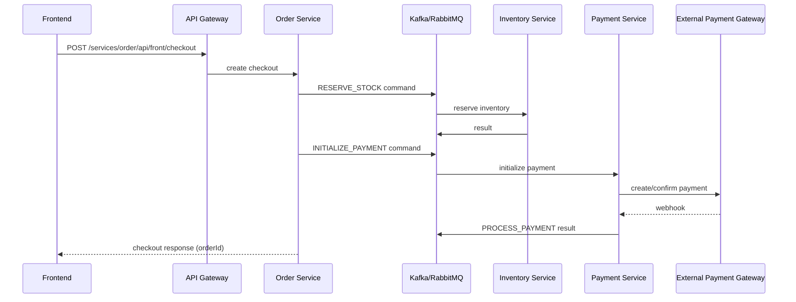

# Atlas

[](https://openjdk.org/)
[](https://spring.io/projects/spring-boot)
[](https://spring.io/projects/spring-cloud)
[](https://gradle.org/)
[](https://docs.docker.com/compose/)
[](https://kubernetes.io/)
[](https://nextjs.org/)
[](https://react.dev/)
[](https://www.typescriptlang.org/)

## Project Overview

Atlas is a modular e-commerce microservices system that demonstrates **DDD + Hexagonal Architecture** with a configurable **app-stack** mechanism.

Each business service follows this structure:

- `domain`: core business models and rules
- `port`: inbound/outbound contracts
- `application`: use cases and orchestration logic
- `api`: REST/gRPC transport layer
- `infrastructure`: adapters (database, messaging, external providers, file/search/storage)
- `bootstrap`: runtime assembly and Spring Boot startup

Shared backend capabilities are implemented as reusable Gradle modules under `backend/libs/` and selected at build time from app-stack configuration.

## Technology Stack

### Backend

- **Core**: Java 17, Spring Boot 4.0.3, Spring Cloud 2025.1.0, Gradle multi-module
- **API & Communication**: Spring MVC REST, Spring Cloud Gateway (WebFlux), gRPC, springdoc OpenAPI
- **Security**: Spring Security, OAuth2 Authorization Server, JWT, optional Keycloak adapter
- **Data & Infra**: MySQL/PostgreSQL, Redis, Kafka/RabbitMQ, Elasticsearch, MinIO
- **Patterns**: Saga, Outbox, modular adapters selected by app-stack
- **Observability**: Actuator, Logback, Prometheus, Loki/Promtail, Zipkin, Grafana
- **Utilities**: Flyway, Quartz, MapStruct, Lombok

### Frontend

- **Framework**: Next.js 16.1.6 (React 19.2.3), TypeScript
- **UI**: Tailwind CSS v4, shadcn/ui, Radix/Base UI
- **State & Forms**: Zustand, React Hook Form, Zod
- **API**: Axios

## Project Structure

```text
.
├── backend/
│   ├── app-stack/
│   │   ├── config/                    # app-stack YAML profiles
│   │   └── deployment/
│   │       ├── generator/             # Handlebars renderer
│   │       └── templates/             # Compose + Helm templates
│   ├── libs/                          # reusable modules (api, data, messaging, observability, ...)
│   ├── platform/
│   │   ├── authorization-server/
│   │   ├── config-server/
│   │   └── discovery-server/
│   │       └── eureka-server/
│   ├── services/
│   │   ├── api-gateway/
│   │   ├── user-service/
│   │   ├── catalog-service/
│   │   ├── inventory-service/
│   │   ├── order-service/
│   │   └── payment-service/
│   ├── install.sh
│   └── uninstall.sh
├── frontend/
│   └── all/                           # unified frontend app (port 8000)
└── README.md
```

## Quick Start (Local)

### Prerequisites

- Java 17+
- Node.js + npm
- Docker Desktop (Docker Compose enabled)
- Recommended resources: 16GB RAM, 8 CPU cores

On Windows, run backend shell scripts via **Git Bash** or **WSL**.

### Backend

```bash
cd backend
./install.sh
```

`install.sh` flow:

1. Read `backend/app-stack/config/app-stack.<name>.yml` (default: `local.dev`)
2. Render templates into `backend/dist/`
3. Execute generated install script from `backend/dist/install.sh`

Common flags:

- `--app-stack=<name>`: choose stack profile (`local.dev`, `local.compose`, `local.k8s`)
- `--skip-build`: skip backend and Docker image builds
- `--debug-template`: render `backend/dist` only, skip deployment

Examples:

```bash
cd backend
./install.sh --app-stack=local.dev
./install.sh --app-stack=local.compose
./install.sh --app-stack=local.compose --skip-build
./install.sh --app-stack=local.compose --debug-template
```

To uninstall:

```bash
cd backend
./uninstall.sh
```

To uninstall and remove application Docker images:

```bash
cd backend
./uninstall.sh --remove-images
```

### Frontend

Frontend app reads:

- `NEXT_PUBLIC_API_BASE_URL` (default `http://localhost:8080`)
- `NEXT_PUBLIC_AUTHORIZATION_API_BASE_URL` (default `http://localhost:8901`)

Unified frontend:

```bash
cd frontend/all
npm install
npm run dev
```

Open: http://localhost:8000

Main storefront routes stay under `/`, `/cart`, `/checkout`, `/order-history`, `/login`, `/register`.
Admin routes are namespaced under `/admin/**` (for example: `/admin/dashboard`).

Default seeded users:
- Admin: `admin@atlas.org` / `Atlas@123456`
- User: `demo@atlas.org` / `Atlas@123456`

## Runtime Components (Docker Compose full stack)

### Application services

| Component | Responsibility | URL |
| --- | --- | --- |
| API Gateway | edge routing and security entrypoint | http://localhost:8080 |
| User Service | user management and profile domain | http://localhost:8081 |
| Catalog Service | product catalog and admin product APIs | http://localhost:8082 |
| Inventory Service | stock management | http://localhost:8083 |
| Order Service | checkout orchestration (Saga) | http://localhost:8084 |
| Payment Service | payment flow and webhook handling | http://localhost:8085 |
| Authorization Server | OAuth2/OIDC + token issuing | http://localhost:8901 |
| Eureka Server | service discovery | http://localhost:8761 |

### Infrastructure services

| Component | Exposed ports |
| --- | --- |
| MySQL | 3306 |
| PostgreSQL | 5432 |
| Redis | 6379 |
| Kafka | 9092 |
| RabbitMQ | 5672, 15672 |
| Elasticsearch | 9200, 9300 |
| MinIO | 9000, 9001 |
| smtp4dev | 5000, 25 |
| Prometheus | 9090 |
| Loki | 3100 |
| Promtail | 9080 |
| Zipkin | 9411 |
| Grafana | 3000 |
| Keycloak (optional profile path) | 8443 |

Common default credentials for local infra are `atlas` / `Atlas@123456` unless overridden by environment variables.

## App Stack

An app stack is a named configuration profile in `backend/app-stack/config/` that drives both:

1. **Gradle module composition** (which adapters/libraries are included)
2. **Deployment rendering** (Docker Compose or Kubernetes manifests)

### Built-in stacks

| Stack | Deployment target | Behavior |
| --- | --- | --- |
| `local.dev` | Docker Compose | infrastructure-focused profile (default) |
| `local.compose` | Docker Compose | full local stack |
| `local.k8s` | Helm chart on Kubernetes | full local Kubernetes profile |

### Supported capability keys

| Capability key | Supported options |
| --- | --- |
| `datasource` | `mysql`, `postgres` |
| `file.csv` | `opencsv` |
| `file.excel` | `poi`, `easyexcel` |
| `file.pdf` | `pdfbox` |
| `idp` | `spring`, `keycloak` |
| `internal` | `rest`, `grpc` |
| `kv-store` | `redis` |
| `messaging` | `kafka`, `rabbitmq` |
| `migration` | `flyway` |
| `notification.email` | `spring`, `sendgrid` |
| `observability.logging.framework` | `logback` |
| `observability.logging.stack` | `none`, `loki` |
| `observability.metrics` | `none`, `prometheus` |
| `observability.tracing` | `none`, `zipkin` |
| `persistence` | `jpa` |
| `redis` | `standalone`, `cluster` |
| `scheduler` | `spring`, `quartz` |
| `search` | `elasticsearch` |
| `service-discovery` | `none`, `eureka`, `kubernetes` |
| `storage` | `minio`, `filesystem` |
| `template` | `freemarker`, `thymeleaf` |

## Checkout Flow (High-level)



## Contributing

- Issues and pull requests are welcome
- Keep modules aligned with DDD and clean architectural boundaries
- Prefer adding adapters over introducing domain-level coupling

## License

- No `LICENSE` file is currently included in this repository
