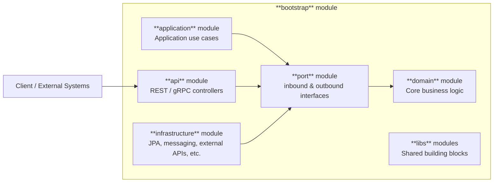
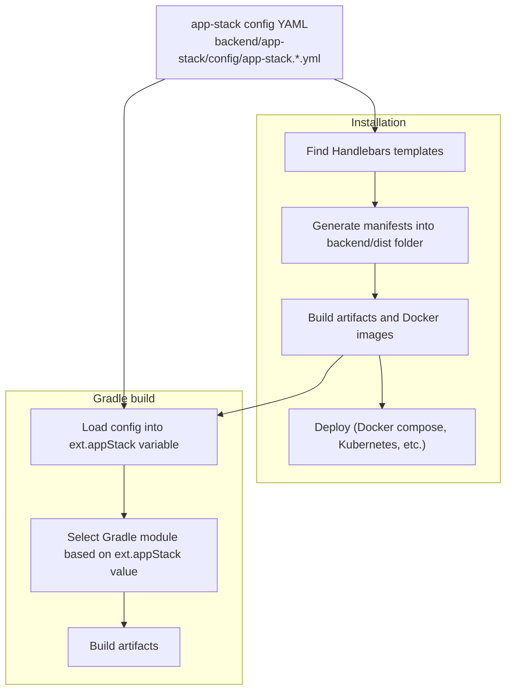
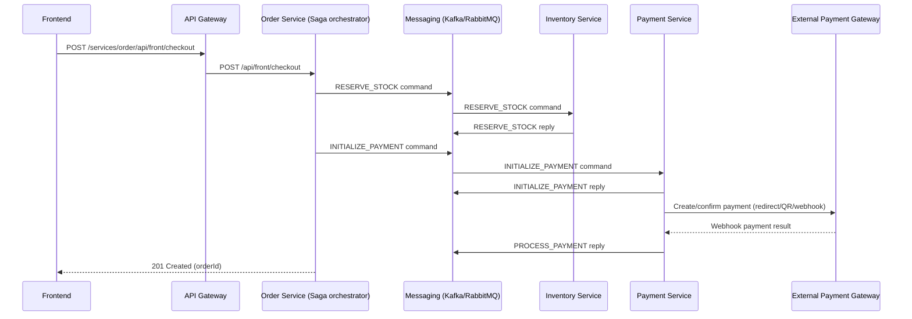

# Atlas

[](https://openjdk.org/)
[](https://spring.io/projects/spring-boot)
[](https://spring.io/projects/spring-cloud)
[](https://gradle.org/)
[](https://docs.docker.com/compose/)
[](https://kubernetes.io/)
[](https://www.mysql.com/)
[](https://www.postgresql.org/)
[](https://redis.io/)
[](https://kafka.apache.org/)
[](https://www.rabbitmq.com/)
[](https://flywaydb.org/)
[](https://resilience4j.readme.io/)
[](https://prometheus.io/)
[](https://grafana.com/)
[](https://zipkin.io/)
[](https://nextjs.org/)
[](https://react.dev/)
[](https://www.typescriptlang.org/)
[](https://tailwindcss.com/)
[](https://axios-http.com/)
[](https://stripe.com/)

## Project Overview

Atlas is a microservices e-commerce system built to demonstrate **DDD + Hexagonal Architecture**, with an **app-stack** mechanism that lets you switch infrastructure technologies gracefully.

In detail, each microservice follows a consistent module layout:

- `domain`: Core business logic as entities, errors, exceptions, etc.
- `port`: Inbound and outbound contracts
- `application`: Use cases and Saga orchestration
- `api`: Transport layer (REST & gRPC)
- `infrastructure`: Adapters (JPA, messaging, external APIs, etc.)
- `bootstrap`: Spring Boot runtime wiring

The architecture also offers building blocks which are shared by microservices.



---

## Technology Stack

### Backend

- **Core**: Java 17, Spring Boot 3.5, Spring Cloud 2025, Gradle (multi-module)
- **API & Communication**: Spring Cloud Gateway, REST (Spring MVC), OpenAPI (springdoc), gRPC
- **Service Platform**: Eureka Server (service discovery), Spring Cloud Config
- **Data & Infrastructure**: MySQL, PostgreSQL, Redis, Kafka, RabbitMQ, Elasticsearch, MinIO, Quartz
- **Security & Integration**: Spring Security (JWT), Keycloak, Stripe, Sendgrid
- **Microservices Patterns**: Saga orchestration, Outbox pattern, Resilience4j
- **Observability**: Actuator, Logback, Loki + Promtail, Prometheus, Zipkin, Grafana
- **Productivity**: Lombok, MapStruct
- **Deployment**: Docker Compose, Kubernetes

### Frontend

- **Framework**: Next.js 16 (React 19), TypeScript
- **UI**: Tailwind CSS, shadcn/ui, Radix UI
- **State & Forms**: Zustand, React Hook Form, Zod

---

## Project Structure

```
.
├── backend/
│   ├── app-stack/
│   │   ├── config/             # app-stack YAML definitions (drives build + deploy)
│   │   ├── generator/          # Node.js template renderer (Handlebars)
│   │   └── templates/          # Compose/Kubernetes templates per app-stack
│   ├── libs/
│   │   ├── framework/          # shared foundation used by all backend services
│   │   └── building-blocks/    # shared building blocks (API server/client, persistence, messaging, observability, saga, outbox, etc.)
│   ├── platform/
│   │   ├── discovery-server/   # Eureka Server
│   │   └── config-server/      # Spring Cloud Config Server
│   ├── scripts/                # helper scripts (setup, local tooling)
│   ├── services/
│   │   ├── api-gateway/        # Spring Cloud Gateway edge service
│   │   ├── identity-service/   # authentication and user management
│   │   ├── catalog-service/    # product catalog
│   │   ├── inventory-service/  # stock management
│   │   ├── order-service/      # checkout + saga orchestration
│   │   └── payment-service/    # payments + webhooks/simulator
│   ├── build.gradle
│   ├── install.sh
│   └── uninstall.sh
├── frontend/
│   ├── admin/                 # Next.js admin dashboard
│   └── storefront/            # Next.js customer-facing storefront
```

---

## Quick Start (Local)

### Prerequisites

- Recommended resources: RAM 16GB, CPU 8 cores
- Java 17+
- Node.js (for frontend and deployment generator)
- Docker Desktop with Docker Compose

Notes:
- On Windows, use Git Bash or WSL to run `./install.sh` in `backend/`.

### Backend

```bash
cd backend
./install.sh
```

This generates `backend/dist/` from templates and then runs the generated install script.

Common flags:
- `--app-stack=...`: app stack name (default: `local.dev`). See **App Stack** section for details.
- `--skip-build`: skips building artifacts and Docker images.
- `--debug-template`: generates `backend/dist/` only, does not execute installation.

Other examples:

```bash
cd backend
./install.sh --app-stack=local.compose
./install.sh --app-stack=local.k8s --debug-template
./install.sh --skip-build
```

To uninstall:

```bash
cd backend
./uninstall.sh
```

To uninstall and remove application Docker images:

```bash
cd backend
./uninstall.sh --remove-images
```

### Frontend

Both frontends default to talking to the gateway at `http://localhost:8080` as default. You can override this by setting `NEXT_PUBLIC_API_BASE_URL` in `.env`.

#### Storefront

```bash
cd frontend/storefront
npm install
npm run dev
```

Open: http://localhost:8000

Login credentials: `demo` / `Atlas@123456`

#### Admin

```bash
cd frontend/admin
npm install
npm run dev
```

Open: http://localhost:8001

Login credentials: `admin` / `Atlas@123456`

---

## Architecture

### System Components

**Microservices**

| Component | Responsibility | Default URL |
| --- | --- | --- |
| API Gateway | Routing, security, aggregated OpenAPI docs | http://localhost:8080 |
| Identity Service | Authentication and user management | http://localhost:8081 |
| Catalog Service | Product catalog and admin operations | http://localhost:8082 |
| Inventory Service | Stock management | http://localhost:8083 |
| Order Service | Checkout and saga orchestration | http://localhost:8084 |
| Payment Service | Payment processing | http://localhost:8085 |

**Platform**

| Component | Responsibility | Exposed Ports |
| --- | --- | --- |
| Eureka Server | Service discovery for microservices (not used in Kubernetes) | 8761 |
| Config Server | Centralized configuration (unused now) | 8888 |

**Infrastructure**

| Component | Responsibility                         | Exposed Ports |
| --- |----------------------------------------| --- |
| MySQL | Database                               | 3306 |
| PostgreSQL | Database                               | 5432 |
| Redis | Key-value store                        | 6379 |
| Elasticsearch | Search engine                          | 9200 |
| MinIO | S3-compatible object storage           | 9000 |
| Kafka | Messaging platform                     | 9092 |
| RabbitMQ | Messaging platform                     | 5672 & 15672 (management UI) |
| Keycloak | Identity provider                      | 8443 |
| Loki | Log aggregation backend                | 3100 |
| Promtail | Log shipping agent                     | 9080 |
| Prometheus | Metrics scraping and storage           | 9090 |
| Zipkin | Distributed tracing backend            | 9411 |
| Grafana | Observability visualization dashboards | 3000 |

Default credentials: `atlas` / `Atlas@123456`

**Frontend**

| Component | Responsibility | Exposed Ports |
| --- | --- | --- |
| Storefront | Customer-facing web store | 8000 |
| Admin | Product catalog and order management | 8001 |

### App Stack

Atlas provides an **app-stack** mechanism. Each app stack is a named profile that controls:

1. Which options are selected for **backend capabilities** (datasource, messaging, storage, observability, etc.), via a YAML configuration file under `backend/app-stack/config/` (for example: `app-stack.local.compose.yml`).

List of options for each capability:

| Capability | Options |
|---|---|
| `datasource` | `mysql` \| `postgres` |
| `file.csv` | `opencsv` |
| `file.excel` | `poi` \| `easyexcel` |
| `file.pdf` | `pdfbox` |
| `search` | `elasticsearch` |
| `identity` | `jwt` \| `keycloak` |
| `internal` | `rest` \| `grpc` |
| `kv-store` | `redis` |
| `messaging` | `kafka` \| `rabbitmq` |
| `migration` | `flyway` |
| `notification.email` | `spring` \| `sendgrid` |
| `observability.logging.framework` | `logback` |
| `observability.logging.stack` | `none` \| `loki` |
| `observability.metrics` | `none` \| `prometheus` |
| `observability.tracing` | `none` \| `zipkin` |
| `persistence` | `jpa` |
| `redis` | `standalone` \| `cluster` |
| `scheduler` | `spring` \| `quartz` |
| `service-discovery` | `eureka` \| `kubernetes` |
| `storage` | `minio` \| `filesystem` |
| `template` | `freemarker` \| `thymeleaf` |

2. Which **deployment type** is targeted (Docker Compose, Kubernetes, etc.). This is driven by [Handlebars](https://handlebarsjs.com/) **templates** under `backend/app-stack/deployment/templates/` (for example: `backend/app-stack/deployment/templates/local/compose/`).

The followings are built-in app stacks:

| App stack | Deployment Type | How to run |
| --- | --- | --- |
| `local.compose` | Docker Compose (default) | `./install.sh` |
| `local.dev` | Docker Compose (without microservices, useful for development in IDE) | `./install.sh --app-stack=local.dev` |
| `local.k8s` | Kubernetes using Helm chart | `./install.sh --app-stack=local.k8s` |

So, how does it work?



### Checkout Flow



---

## Contributing

- Issues and PRs are welcome
- Keep modules aligned with DDD/Clean Architecture
- Prefer adding adapters over changing domain logic

## License

- No LICENSE file is included in this repository
- Add a `LICENSE` file if you plan to distribute
