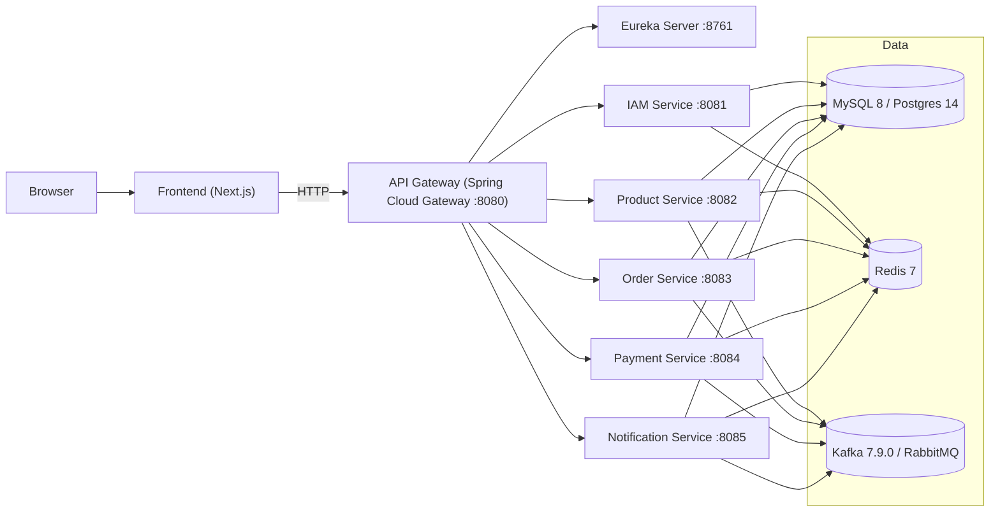
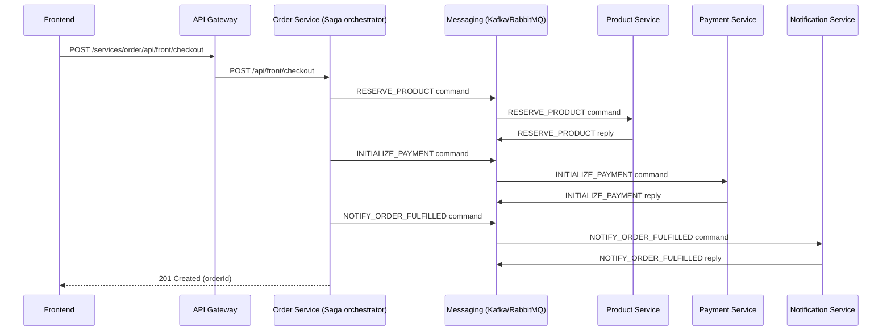

# Atlas

[](https://openjdk.org/)
[](https://spring.io/projects/spring-boot)
[](https://spring.io/projects/spring-cloud)
[](https://nextjs.org/)
[](https://react.dev/)
[](https://docs.docker.com/compose/)
[](https://kubernetes.io/)

## Table of Contents

- Project Overview
- Architecture Diagram
- Technology Stack
- Project Structure
- Getting Started
- Documentation
- Contributing
- License

## Project Overview

Atlas is a microservices-based e-commerce platform showcasing DDD and Hexagonal architecture.

### Hexagonal Architecture

Each service follows a consistent module layout:

- `domain`: aggregates, entities, value objects
- `port`: inbound and outbound contracts
- `application`: use cases and orchestration
- `infrastructure`: adapters (JPA, messaging, files, external APIs)
- `bootstrap`: Spring Boot runtime wiring

### App Stack

The app-stack configuration allows swapping infrastructure components (database, cache, messaging,
auth, storage, observability) with minimal code changes. App-stack selection drives both Gradle
module wiring and deployment generation. See `backend/config/app-stack.*.yml`.

### Architecture Diagram





### Microservices Overview

| Service | Responsibility | Default Port |
| --- | --- | --- |
| API Gateway | Routing, security, aggregated API docs | 8080 |
| IAM Service | Authentication and user management | 8081 |
| Product Service | Product catalog and admin | 8082 |
| Order Service | Checkout and saga orchestration | 8083 |
| Payment Service | Payment processing and simulation | 8084 |
| Notification Service | Notifications and email | 8085 |
| Eureka Server | Service discovery | 8761 |
| Config Server | Externalized configuration | 8888 |

## Technology Stack

### Backend

- Java 17
- Spring Boot 3.5.4
- Spring Framework 6.2.9
- Spring Cloud 2025.0.0
- Gradle (multi-module)
- MySQL 8 / Postgres 14 (configurable)
- Redis 7 (configurable)
- Kafka 7.9.0 or RabbitMQ (configurable)

### Frontend

- Next.js 16.0.1 (React 19.2.0)
- TypeScript
- Tailwind CSS
- Axios

### Deployment & Observability

- Docker & Docker Compose (primary local stack)
- Kubernetes templates (optional)
- Loki / Promtail, Prometheus, Zipkin, Grafana (optional, configurable)

## Project Structure

```
.
├── backend/
│   ├── config/            # app-stack definitions
│   ├── deployment/        # generator + templates
│   ├── libs/              # shared adapters (messaging, storage, observability, etc.)
│   ├── platform/          # config-server, discovery-server
│   ├── services/          # api-gateway, iam, product, order, payment, notification
│   ├── build.gradle
│   └── install.sh
├── frontend/
└── docs/
```

## Getting Started

### Prerequisites

- Java 17+
- Node.js (for frontend and deployment generator)
- Docker Desktop with Docker Compose

### Backend

```bash
cd backend
./install.sh
```

Supported app-stacks:
- dev (default)
- local.compose
- local.k8s.native

Flags:
- `--app-stack <name>` select the app-stack config (default: `local.compose`).
- `--skip-build` skip building application services and use existing artifacts.
- `--infra-only` deploy only infrastructure components and skip application services.
- `--enable-observability <true|false>` toggle observability stacks in generated deployments.
- Special case: `--app-stack dev` defaults `infra-only` to `true` unless explicitly set.

Notes:
- Requires Node.js to render EJS templates
- If `ejs` is missing, install in `backend/deployment/generator/` via `npm install ejs --save`
- On Windows, use Git Bash or WSL to run `install.sh`
- Re-running `install.sh` regenerates `backend/deployment/dist/`

### Frontend

```bash
cd frontend
npm install
npm run dev
```

Open: http://localhost:8000

### Access URLs

- Frontend: http://localhost:8000
- API Gateway: http://localhost:8080
- Swagger UI (Gateway): http://localhost:8080/swagger-ui.html
- Eureka: http://localhost:8761
- Grafana: http://localhost:3000
- Prometheus: http://localhost:9090
- Zipkin: http://localhost:9411

### Default Credentials (dev)

- Admin: `admin` / `Aa@123456`
- Storefront: `demo` / `Aa@123456`

## Contributing

- Issues and PRs are welcome
- Keep modules aligned with DDD/Clean Architecture
- Prefer adding adapters over changing domain logic

## License

- No LICENSE file is included in this repository
- Add a `LICENSE` file if you plan to distribute
