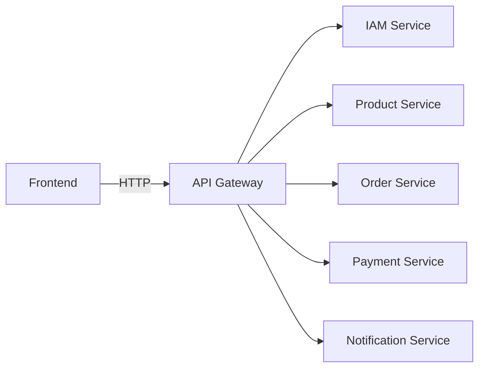

# API Gateway Pattern: Architectural Deep Dive

## Conceptual Foundation

An API Gateway represents a sophisticated architectural pattern that serves as a unified entry point and facade for distributed systems, particularly microservices architectures. This pattern fundamentally transforms how client applications interact with backend services by introducing an intermediary layer that handles cross-cutting concerns and provides a cohesive API surface.

### Architectural Role and Positioning

The API Gateway operates as a reverse proxy positioned between external clients and internal microservices. It encapsulates the complexity of the underlying service mesh while exposing a simplified, client-specific API interface. This architectural positioning enables several critical capabilities:

- **Protocol Translation**: Bridges differences between external client protocols and internal service communication patterns
- **Service Aggregation**: Combines responses from multiple microservices into unified responses
- **Security Enforcement**: Centralizes authentication, authorization, and security policy enforcement
- **Traffic Management**: Implements sophisticated routing, load balancing, and rate limiting strategies

## Theoretical Underpinnings

### The Gateway Pattern in Distributed Systems

The API Gateway pattern draws from several established software architecture principles:

1. **Facade Pattern**: Provides a simplified interface to a complex subsystem
2. **Proxy Pattern**: Controls access to another object while adding additional functionality
3. **Mediator Pattern**: Coordinates interactions between multiple components
4. **Single Responsibility Principle**: Centralizes cross-cutting concerns that would otherwise be duplicated across services

### Microservices Communication Challenges

In distributed systems without an API Gateway, clients face significant architectural challenges:

| Challenge | Impact | Gateway Solution |
|-----------|---------|------------------|
| **Chatty Communication** | Multiple round-trips increase latency and complexity | Request aggregation and response composition |
| **Protocol Mismatch** | Clients and services may use different communication protocols | Protocol translation and adaptation |
| **Service Discovery** | Clients need dynamic service location capabilities | Integrated service registry integration |
| **Security Fragmentation** | Each service implements security independently | Centralized security enforcement |
| **Versioning Complexity** | Multiple service versions create client compatibility issues | Version-based routing and content negotiation |

## Why Use an API Gateway? Comprehensive Analysis

### Performance Optimization

API Gateways significantly reduce client-side latency through several mechanisms:

- **Request Collapsing**: Multiple client requests can be combined into single backend calls
- **Response Caching**: Frequently accessed data is cached at the gateway layer
- **Connection Pooling**: Reuses backend connections to avoid expensive connection establishment
- **Payload Optimization**: Compresses responses and optimizes data formats for client consumption

### Architectural Decoupling

The gateway enables loose coupling between clients and services through:

- **Abstraction Layer**: Hides internal service structure and implementation details
- **Adaptive Routing**: Routes requests based on content, headers, or business logic rather than fixed URLs
- **Transformation Capabilities**: Modifies requests and responses to maintain compatibility during service evolution

### Operational Benefits

From an operational perspective, API Gateways provide:

- **Centralized Monitoring**: Single point for collecting metrics, logs, and performance data
- **Traffic Control**: Fine-grained control over request routing and traffic shaping
- **Error Handling**: Unified error responses and fault tolerance mechanisms
- **Canary Deployment**: Gradual rollout of new service versions with traffic splitting

---

## Core Functions: Technical Deep Dive

### Request Routing and Composition

API Gateways implement sophisticated routing mechanisms that go beyond simple path-based routing:

| Routing Type | Implementation | Use Case | Technical Considerations |
|--------------|----------------|----------|-------------------------|
| **Path-Based Routing** | Routes based on URL path patterns | Basic service mapping | Simple to configure, limited flexibility |
| **Header-Based Routing** | Routes based on HTTP headers | A/B testing, canary releases | Requires header inspection, more complex |
| **Content-Based Routing** | Routes based on request body content | Protocol transformation, message routing | Performance impact from body parsing |
| **Weighted Routing** | Distributes traffic by percentage | Gradual rollouts, blue-green deployments | Requires traffic management capabilities |
| **Service Composition** | Aggregates multiple service responses | Dashboard data, combined views | Introduces latency from parallel calls |

### Security Implementation Patterns

API Gateways centralize security concerns through multiple enforcement mechanisms:

| Security Mechanism | Implementation Approach | Technical Benefits |
|--------------------|-------------------------|-------------------|
| **JWT Validation** | Validates token signatures and claims | Stateless validation, scalable |
| **OAuth 2.0/OIDC** | Integrates with identity providers | Standardized authentication flows |
| **Role-Based Access Control** | Enforces permissions based on user roles | Fine-grained authorization |
| **API Key Management** | Validates client API keys | Simple client authentication |
| **Rate Limiting** | Enforces request quotas per client/service | Prevents abuse and DoS attacks |
| **IP Whitelisting** | Restricts access based on client IP | Additional security layer |

### Performance Optimization Techniques

Modern API Gateways employ various performance optimization strategies:

| Optimization Technique | Implementation | Performance Impact |
|-----------------------|----------------|-------------------|
| **Response Caching** | Caches backend responses at gateway layer | Reduces backend load, improves latency |
| **Connection Pooling** | Reuses backend connections | Eliminates TCP handshake overhead |
| **Request Batching** | Combines multiple requests | Reduces network round-trips |
| **Payload Compression** | Compresses response bodies | Reduces bandwidth consumption |
| **Protocol Buffers** | Uses binary serialization | Faster serialization/deserialization |

### Advanced Traffic Management

Sophisticated traffic management capabilities enable operational excellence:

| Traffic Management Feature | Implementation | Operational Benefit |
|---------------------------|----------------|-------------------|
| **Circuit Breaking** | Stops routing to failing services | Prevents cascading failures |
| **Retry Mechanisms** | Automatically retries failed requests | Improves success rates for transient errors |
| **Timeout Management** | Enforces request timeouts | Prevents resource exhaustion |
| **Load Shedding** | Drops requests during overload | Maintains system stability |
| **Canary Deployment** | Gradual traffic shift to new versions | Reduces deployment risk |

---

## Comprehensive Architectural Trade-offs

### Benefits: Technical Advantages

API Gateways provide significant architectural benefits that justify their complexity:

| Benefit Category | Technical Implementation | Impact on System Architecture |
|------------------|--------------------------|------------------------------|
| **Architectural Abstraction** | Hides service topology and implementation details | Enables independent service evolution and refactoring |
| **Client-Side Simplification** | Provides unified API surface and response aggregation | Reduces mobile/web client complexity and network chatter |
| **Cross-Cutting Centralization** | Implements security, logging, monitoring in one place | Eliminates code duplication across microservices |
| **Protocol Transformation** | Bridges different communication protocols and data formats | Enables heterogeneous service integration |
| **Traffic Management** | Implements sophisticated routing and load balancing | Improves system reliability and performance |

### Drawbacks: Technical Challenges and Mitigations

While powerful, API Gateways introduce several architectural challenges that require careful consideration:

| Challenge | Technical Impact | Mitigation Strategies |
|-----------|------------------|----------------------|
| **Single Point of Failure** | Gateway failure makes entire system unavailable | Implement high availability with active-active clustering and automatic failover |
| **Performance Bottleneck** | All traffic flows through gateway, creating potential choke point | Use horizontal scaling, load balancing, and performance optimization techniques |
| **Increased Latency** | Additional hop introduces network latency | Implement caching, connection pooling, and request optimization |
| **Operational Complexity** | Additional component to deploy, monitor, and maintain | Use infrastructure-as-code, automated deployment, and comprehensive monitoring |
| **Gateway Monolith Risk** | Business logic accumulation creates new monolith | Strictly enforce gateway responsibilities and avoid business logic |
| **Versioning Complexity** | Gateway must handle multiple service versions | Implement version-based routing and content negotiation |

### Implementation Considerations

When implementing an API Gateway, consider these technical factors:

| Consideration | Technical Implications | Best Practices |
|---------------|------------------------|----------------|
| **Technology Selection** | Choice between off-the-shelf vs custom implementation | Evaluate Kong, Spring Cloud Gateway, Envoy, or custom solutions based on requirements |
| **Deployment Strategy** | How to deploy and scale the gateway component | Use containerization, orchestration, and auto-scaling policies |
| **Monitoring and Observability** | Comprehensive monitoring of gateway performance | Implement distributed tracing, metrics collection, and log aggregation |
| **Security Configuration** | Centralized security policy management | Use external configuration and secret management systems |
| **Performance Tuning** | Optimizing gateway for high throughput and low latency | Profile and optimize critical paths, implement caching strategies |

---

## Atlas Notes

The Atlas system uses an API Gateway to act as a single entry point, routing requests to the appropriate microservices and enforcing cross-cutting policies.

- **Implementation**: Spring Cloud Gateway server at `backend/services/api-gateway/spring-cloud-gateway/spring-cloud-gateway-server`
- **Default port**: `8080` (see gateway `application.yml`)
- **API docs**: The gateway exposes an aggregated Swagger UI at `/swagger-ui.html`

### How It Works in Atlas
1.  Client sends a request to the API Gateway.
2.  Gateway forwards the request to the right microservice based on route predicates defined in `application.yml`.
3.  Gateway applies filters such as JWT validation, role checks, and rate limiting before forwarding the request.

### Key Responsibilities in this Repository:

- **Routing and Path Rewriting**: Maps external-facing URLs to internal service paths.
- **Security**: Handles JWT validation and role-based access control for admin routes.
- **Token Relay**: Forwards the client's token to downstream services.
- **Rate Limiting**: Implements rate limiting with a custom key resolver to prevent abuse.
- **API Aggregation**: Provides an aggregated Swagger UI for all backend services.

## Routing Conventions (Atlas)

- External gateway prefixes: `/services/<service>/api/...`
- Admin routes add `Authorization=ADMIN` and `TokenValidation`
- IAM authentication routes are unauthenticated

Route map (see gateway `application.yml`):

- `/services/iam/api/authentication/**` → IAM `/api/authentication/**`
- `/services/iam/api/front/**` → IAM `/api/front/**`
- `/services/iam/api/admin/**` → IAM `/api/admin/**` (ADMIN)
- `/services/product/api/front/**` → Product `/api/front/**`
- `/services/product/api/admin/**` → Product `/api/admin/**` (ADMIN)
- `/services/order/api/front/**` → Order `/api/front/**`
- `/services/order/api/admin/**` → Order `/api/admin/**` (ADMIN)
- `/services/payment/api/front/**` → Payment `/api/front/**`
- `/services/payment/api/webhook/**` → Payment `/api/webhook/**`
- `/services/notification/api/**` → Notification `/api/**`
- `/services/notification/sse/**` → Notification `/sse/**` (SSE)
- `/services/notification/ws/**` → Notification `/ws/**`

## API Docs (Atlas)

- Swagger UI: `http://localhost:8080/swagger-ui.html`
- OpenAPI docs (aggregated by gateway):
  - `http://localhost:8080/api-docs/iam-service`
  - `http://localhost:8080/api-docs/product-service`
  - `http://localhost:8080/api-docs/order-service`
  - `http://localhost:8080/api-docs/payment-service`
  - `http://localhost:8080/api-docs/notification-service`
