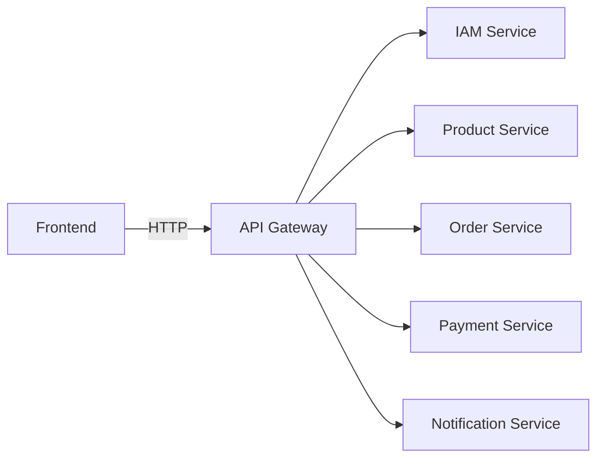

# API gateway

The API Gateway acts as a single entry point, routing requests to the appropriate microservices.

## Atlas notes

- Implementation: Spring Cloud Gateway server at `backend/services/api-gateway/spring-cloud-gateway/spring-cloud-gateway-server`
- Default port: `8080` (see gateway `application.yml`)
- API docs: the gateway exposes an aggregated Swagger UI at `/swagger-ui.html`

How It Works:
1. Client sends a request to the API Gateway. 
2. Gateway forwards the request to the right microservice(s).
3. Gateway aggregates responses if needed and returns a single apiResponseWrapper to the client.

Solution:
- Spring Cloud Gateway (`backend/services/api-gateway/...`)

Checklist:
- [x] Routing
- [x] Authentication
- [x] CORS
- [x] Rate limiting
- [ ] Aggregate ApiResponseWrapper
- [x] API document

## Routing conventions (Atlas)

- External gateway prefixes: `/services/<service>/api/...`
- Example mappings (see gateway `application.yml`):
  - `/services/iam/api/front/**` -> IAM `/api/front/**`
  - `/services/product/api/front/**` -> Product `/api/front/**`
  - `/services/order/api/front/**` -> Order `/api/front/**`
  - `/services/payment/api/front/**` -> Payment `/api/front/**`
  - `/services/notification/api/**` -> Notification `/api/**`

## API Docs (Atlas)

- Swagger UI: `http://localhost:8080/swagger-ui.html`
- OpenAPI docs (aggregated by gateway):
  - `http://localhost:8080/api-docs/iam-service`
  - `http://localhost:8080/api-docs/product-service`
  - `http://localhost:8080/api-docs/order-service`
  - `http://localhost:8080/api-docs/payment-service`
  - `http://localhost:8080/api-docs/notification-service`
