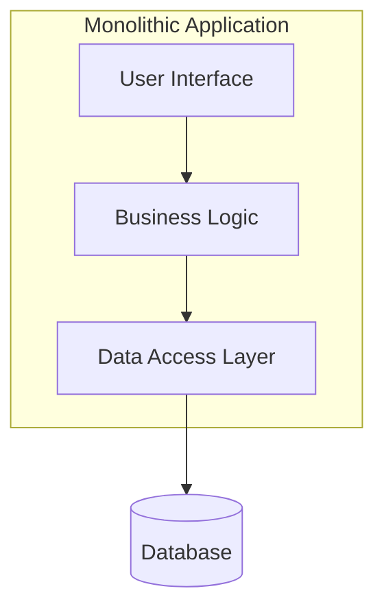
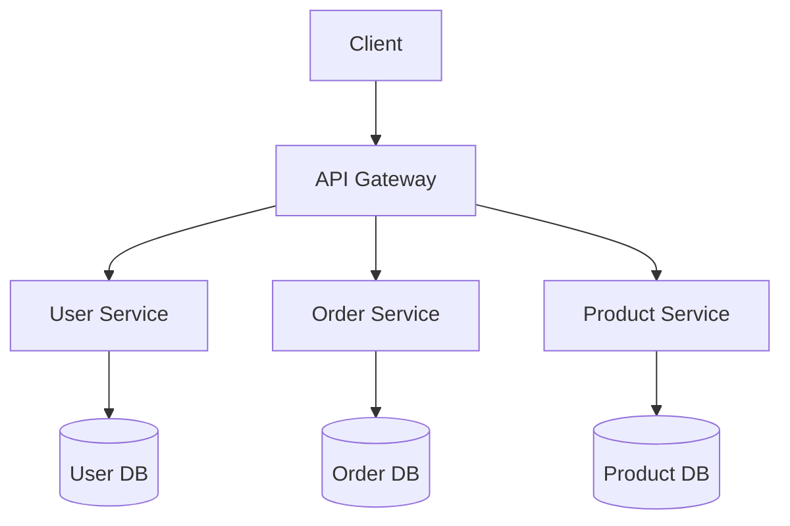
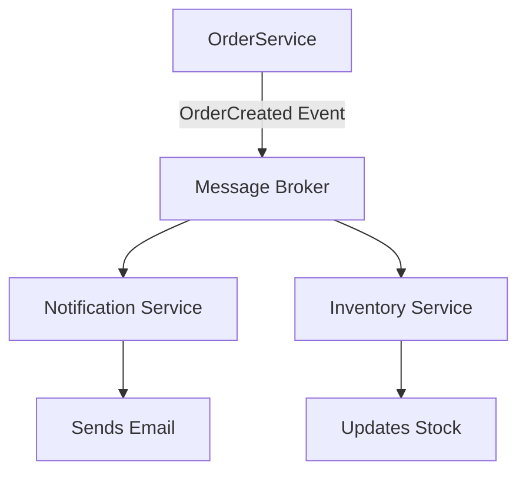

# Software Architectural Styles

Software architecture defines the high-level structure of a software system, the discipline of creating such structures, and the documentation of these structures. It is about making fundamental structural choices that are costly to change once implemented.

---

## Comparison of Major Architectural Styles

This table provides a high-level comparison of the most common architectural styles.

| Style | Key Characteristics | When to Use |
| :--- | :--- | :--- |
| **Monolithic** | Single, unified codebase and deployment unit. | Small to medium-sized applications, startups, and projects with a small team. |
| **Microservices** | A collection of small, autonomous services, each representing a business capability. | Large, complex applications that require high scalability and independent team workflows. |
| **Serverless** | The application is hosted by a third-party service, eliminating the need for server software and hardware management. | Event-driven applications, background tasks, and applications with unpredictable traffic. |
| **Event-Driven** | System components communicate via asynchronous events (messages). | Asynchronous systems, complex workflows, and applications requiring high scalability and resilience. |
| **Layered** | Components are organized into horizontal layers, each with a specific responsibility (e.g., presentation, business, data). | Traditional enterprise applications where a clear separation of concerns is needed. |

---

## 1. Monolithic Architecture

In a monolithic architecture, all components of the application are built as a single, indivisible unit. The entire application is deployed as a single artifact (e.g., a WAR or JAR file).

**Diagram:**


| Pros | Cons |
| :--- | :--- |
| **Simplicity:** Easy to develop, test, and deploy. | **Scalability Issues:** The entire application must be scaled, even if only one component is a bottleneck. |
| **Performance:** In-process communication is fast. | **Low Agility:** A small change requires redeploying the entire application, slowing down release cycles. |
| **Easier Debugging:** All code runs in a single process, making it easier to trace and debug. | **High Blast Radius:** A bug in one module can bring down the entire application. |
| **Lower Initial Cost:** Simpler to set up and manage initially. | **Technology Lock-in:** Difficult to adopt new technologies or frameworks. |

---

## 2. Microservices Architecture

A microservices architecture structures an application as a collection of loosely coupled, independently deployable services. Each service is self-contained and implements a single business capability.

**Diagram:**


| Pros | Cons |
| :--- | :--- |
| **Independent Scalability:** Each service can be scaled independently based on its specific needs. | **Operational Complexity:** Requires sophisticated CI/CD, monitoring, and service discovery mechanisms. |
| **Technology Diversity:** Teams can choose the best technology stack for their specific service. | **Distributed System Challenges:** Dealing with network latency, fault tolerance, and data consistency is complex. |
| **Improved Fault Isolation:** Failure in one service does not necessarily impact the entire application. | **Higher Initial Cost:** Requires significant investment in infrastructure and automation. |
| **Team Autonomy:** Small, autonomous teams can develop, deploy, and manage their services independently. | **Difficult to Debug:** Tracing a request across multiple services can be challenging without proper observability tools. |

---

## 3. Serverless Architecture

Serverless computing is a cloud computing execution model in which the cloud provider runs the server and dynamically manages the allocation of machine resources. Pricing is based on the actual amount of resources consumed by an application, rather than on pre-purchased units of capacity.

**Diagram:**
```mermaid
graph TD
    Client --> APIGateway[API Gateway]
    APIGateway --> AuthFunction[Auth Function (Lambda)]
    APIGateway --> ProcessFunction[Process Data Function (Lambda)]
    ProcessFunction --> DynamoDB[(DynamoDB)]
    AuthFunction --> Cognito[(Cognito)]
```

| Pros | Cons |
| :--- | :--- |
| **No Server Management:** Developers can focus on code without worrying about infrastructure. | **Vendor Lock-in:** Tightly coupled to a specific cloud provider's ecosystem. |
| **Pay-per-Use:** You only pay for the compute time you consume. | **Cold Starts:** There can be latency the first time a function is invoked after a period of inactivity. |
| **Automatic Scaling:** The cloud provider automatically scales the application in response to demand. | **Limited Execution Time:** Functions often have a maximum execution duration. |
| **Reduced Operational Cost:** Lower costs for applications with variable or unpredictable traffic. | **Debugging and Monitoring Challenges:** Can be more difficult to debug and monitor than traditional applications. |

---

## 4. Event-Driven Architecture (EDA)

In an event-driven architecture, services communicate through the production and consumption of events. This promotes loose coupling and allows services to operate asynchronously.

**Diagram:**


| Pros | Cons |
| :--- | :--- |
| **Loose Coupling:** Services are decoupled; the event producer does not know about the event consumers. | **Complexity in Debugging:** Tracing the flow of an event across multiple services can be difficult. |
| **High Scalability & Resilience:** Services can be scaled independently, and the failure of a consumer does not affect the producer. | **Eventual Consistency:** Data consistency is not guaranteed immediately, which may not be suitable for all use cases. |
| **Asynchronous Workflows:** Ideal for long-running processes and workflows that can be executed in the background. | **Ordering and Exactly-Once Delivery:** Guaranteeing the order of events and that they are processed exactly once can be challenging. |
| **Real-time Responsiveness:** Enables applications to respond to events as they happen. | **Requires a Robust Messaging Infrastructure:** A reliable message broker is a critical component. |

---

## How to Choose the Right Architecture

There is no one-size-fits-all solution. The choice of architecture depends on several factors:

- **Team Size and Expertise:** Do you have the skills and resources to manage a complex distributed system?
- **Domain Complexity:** Is the business domain large and complex enough to warrant being split into microservices?
- **Scalability Requirements:** Does the application need to handle a large volume of traffic or scale specific components independently?
- **Time to Market:** How quickly do you need to deliver the product? A monolith is often faster to get started with.
- **Budget:** What is your budget for development, infrastructure, and operational overhead?

**Practical Guidance:**
- **Start with a Modular Monolith:** For most new projects, a well-structured modular monolith is the best starting point. It offers a good balance of simplicity and maintainability.
- **Evolve to Microservices:** As the application and team grow, you can gradually refactor the monolith into microservices by carving out the most critical or resource-intensive components first.
- **Invest in DevOps and Observability:** Regardless of the architecture, a strong DevOps culture and robust observability tools (logging, metrics, tracing) are essential for success.

