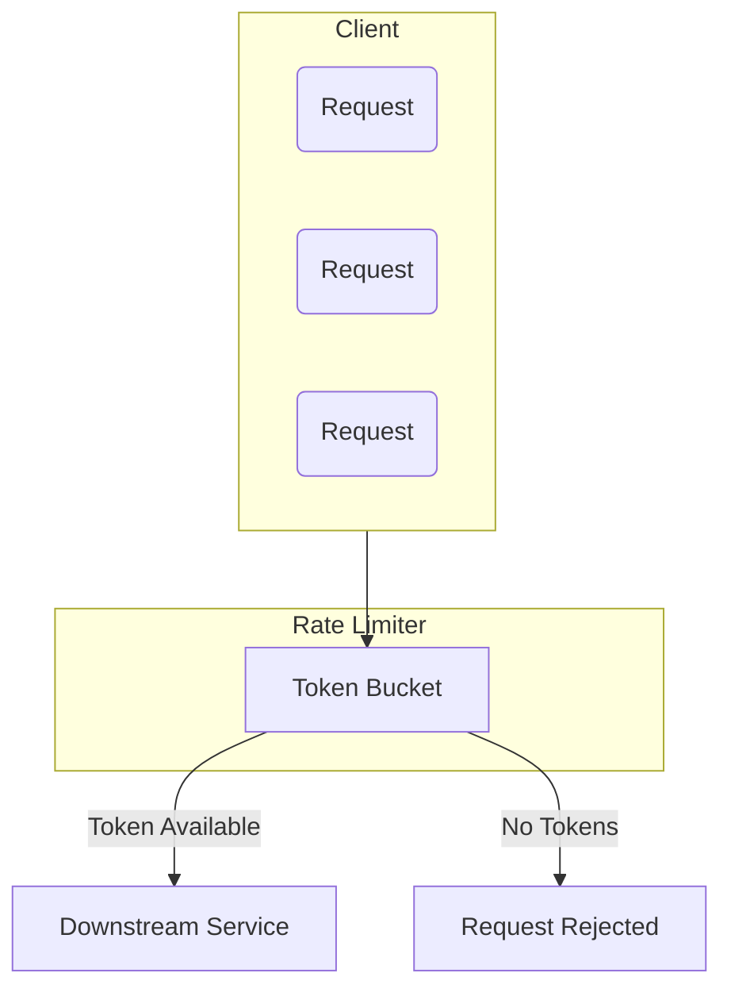
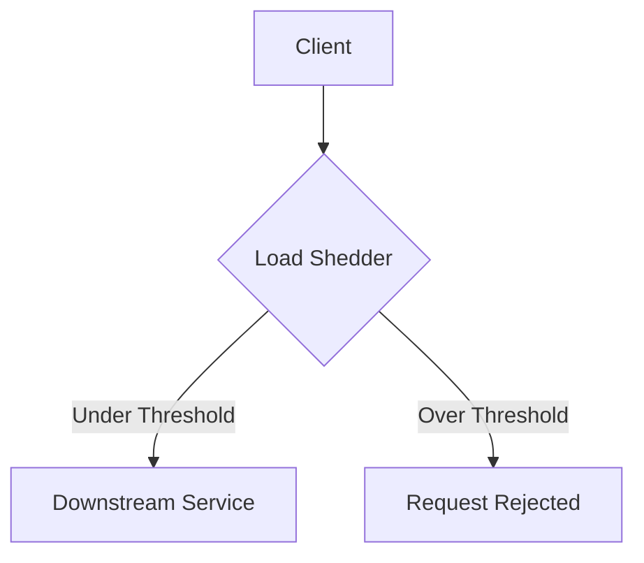
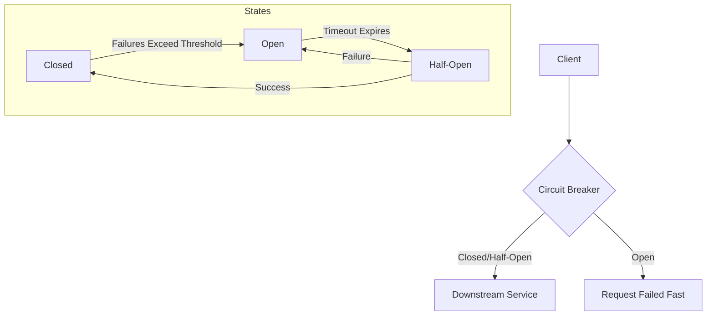

# Backpressure Handling in Distributed Systems

Backpressure is a form of feedback-based flow control. In a distributed system, it refers to the resistance or force opposing the desired flow of data from a source to a destination. It occurs when a downstream component cannot keep up with the rate of requests from an upstream component.

Without effective backpressure handling, a system under high load can suffer from:
- **Service Overload:** Components become overwhelmed, leading to high latency and errors.
- **Cascading Failures:** The failure of one service can ripple through the system, causing widespread outages.
- **Data Loss:** If buffers overflow, incoming data or requests may be dropped.

This document outlines common techniques for managing backpressure.

---

## Comparison of Backpressure Techniques

| Technique | Core Idea | How it Works | Primary Use Case |
| :--- | :--- | :--- | :--- |
| **Rate Limiting** | Control the rate of incoming requests. | A "token bucket" or similar algorithm limits the number of requests allowed in a time window. | Protecting APIs from abuse and ensuring fair usage among clients. |
| **Load Shedding** | Drop excess requests when overloaded. | When a load threshold is exceeded, the system intentionally rejects new requests to protect its stability. | Graceful degradation under extreme load, ensuring critical services remain available. |
| **Circuit Breaking**| Stop sending requests to a failing service. | A "circuit breaker" monitors a downstream service for failures. If failures exceed a threshold, it "opens" the circuit and fails fast. | Preventing cascading failures and improving system resilience when a dependency is unavailable. |
| **Buffering** | Temporarily store requests in a queue. | A buffer (e.g., a message queue) absorbs spikes in traffic, allowing the consumer to process requests at its own pace. | Decoupling services that operate at different speeds and smoothing out load spikes. |

---

## 1. Rate Limiting (Token Bucket)

The Token Bucket algorithm is a common rate-limiting technique. It controls the rate of requests by maintaining a "bucket" of tokens. Each request consumes a token, and tokens are refilled at a constant rate. If the bucket is empty, requests are either delayed or rejected.

**Diagram:**


**Key Characteristics:**
- **Token Refill Rate:** The rate at which tokens are added to the bucket. This defines the average request rate.
- **Bucket Capacity:** The maximum number of tokens the bucket can hold. This allows for short bursts of traffic.
- **Request Handling:** If a token is available, the request passes. If not, it is rejected or queued.

**Example Use Case:** An API gateway limiting a specific client to 100 requests per minute to ensure fair usage.

```java
import java.util.concurrent.Executors;
import java.util.concurrent.ScheduledExecutorService;
import java.util.concurrent.Semaphore;
import java.util.concurrent.TimeUnit;

public class TokenBucketRateLimiter {
    private final Semaphore tokens;
    private final int maxTokens;
    private final int refillRate;
    private final TimeUnit timeUnit;

    public TokenBucketRateLimiter(int maxTokens, int refillRate, TimeUnit timeUnit) {
        this.maxTokens = maxTokens;
        this.refillRate = refillRate;
        this.timeUnit = timeUnit;
        this.tokens = new Semaphore(maxTokens);
        startRefillThread();
    }

    private void startRefillThread() {
        ScheduledExecutorService scheduler = Executors.newScheduledThreadPool(1);
        scheduler.scheduleAtFixedRate(() -> {
            tokens.release(Math.min(maxTokens - tokens.availablePermits(), refillRate));
        }, 0, 1, timeUnit);
    }

    public boolean tryConsume() {
        return tokens.tryAcquire();
    }
}
```

---

## 2. Load Shedding

Load shedding is a defensive mechanism where a system intentionally drops excess requests when it becomes overloaded. This protects the system's core functionality from degrading or failing completely.

**Diagram:**


**Key Characteristics:**
- **Threshold-Based:** Shedding begins when a metric (e.g., CPU usage, memory, request queue length) crosses a predefined threshold.
- **Priority-Based:** Often, requests are prioritized, and low-priority requests are shed first.
- **Graceful Degradation:** The system remains operational for high-priority requests instead of crashing.

**Example Use Case:** A video streaming service under extreme load might shed requests for lower-quality streams to ensure high-quality streams remain available.

```java
import java.util.concurrent.atomic.AtomicInteger;

public class LoadShedder {
    private final int maxConcurrentRequests;
    private final AtomicInteger currentRequests = new AtomicInteger(0);

    public LoadShedder(int maxConcurrentRequests) {
        this.maxConcurrentRequests = maxConcurrentRequests;
    }

    public boolean tryProcessRequest() {
        if (currentRequests.get() >= maxConcurrentRequests) {
            System.out.println("Request rejected (load shedding).");
            return false; // Shedding load
        }
        
        currentRequests.incrementAndGet();
        try {
            // Simulate processing
            System.out.println("Request processed.");
            return true;
        } finally {
            currentRequests.decrementAndGet();
        }
    }
}
```

---

## 3. Circuit Breaking

The Circuit Breaker pattern prevents an application from repeatedly trying to execute an operation that is likely to fail. After a configured number of failures, the circuit breaker "trips" or "opens," and for a period of time, all subsequent calls to the circuit breaker return with an error, without the protected operation ever being attempted.

**States:**
1.  **Closed:** The service is functioning normally. Requests are passed through.
2.  **Open:** The service is failing. Requests are blocked immediately for a timeout period.
3.  **Half-Open:** After the timeout, the circuit allows a limited number of test requests through. If they succeed, the circuit closes. If they fail, it returns to the open state.

**Diagram:**


**Example Use Case:** A microservice that calls an external payment gateway. If the gateway becomes unresponsive, the circuit breaker opens, preventing the service from hanging while waiting for responses.

```java
public class CircuitBreaker {
    private enum State { CLOSED, OPEN, HALF_OPEN }

    private State state = State.CLOSED;
    private int failureCount = 0;
    private final int failureThreshold;
    private final long timeoutMillis;
    private long lastFailureTime;

    public CircuitBreaker(int failureThreshold, long timeoutMillis) {
        this.failureThreshold = failureThreshold;
        this.timeoutMillis = timeoutMillis;
    }

    public boolean allowRequest() {
        long now = System.currentTimeMillis();
        if (state == State.OPEN) {
            if (now - lastFailureTime > timeoutMillis) {
                state = State.HALF_OPEN;
                return true; // Allow a test request
            }
            return false; // Circuit is open
        }
        return true; // Circuit is closed or half-open
    }

    public void recordSuccess() {
        if (state == State.HALF_OPEN) {
            state = State.CLOSED;
        }
        failureCount = 0;
    }

    public void recordFailure() {
        failureCount++;
        if (state == State.HALF_OPEN || failureCount >= failureThreshold) {
            state = State.OPEN;
            lastFailureTime = System.currentTimeMillis();
        }
    }
}
```

---

## 4. Buffering

Buffering involves using a queue to temporarily store incoming requests. This smooths out spikes in traffic and decouples the producer of requests from the consumer, allowing them to operate at different rates.

**Diagram:**
```mermaid
graph TD
    Producer --> Buffer[Buffer (Queue)]
    Buffer --> Consumer
```

**Key Characteristics:**
- **Temporary Storage:** Requests are held in a buffer until the consumer is ready.
- **Load Smoothing:** Absorbs sudden spikes in traffic, allowing the system to process them gradually.
- **Asynchronous Communication:** Enables producers and consumers to work independently without blocking each other.

**Example Use Case:** A message queue like RabbitMQ or Kafka is used to buffer events between microservices. An `OrderService` produces an `OrderCreated` event, which is consumed by a `NotificationService` at its own pace.

```java
import java.util.concurrent.BlockingQueue;
import java.util.concurrent.LinkedBlockingQueue;

public class BufferingSystem {
    private final BlockingQueue<String> buffer;

    public BufferingSystem(int capacity) {
        this.buffer = new LinkedBlockingQueue<>(capacity);
    }

    public boolean produce(String request) {
        // Non-blocking: returns false if the buffer is full
        return buffer.offer(request); 
    }

    public String consume() throws InterruptedException {
        // Blocking: waits if the buffer is empty
        return buffer.take();
    }
}
```

---

## Choosing the Right Technique

The best backpressure strategy depends on the specific problem you are trying to solve:

- Use **Rate Limiting** to enforce usage policies and prevent abuse from specific clients.
- Use **Load Shedding** as a last resort to maintain system stability during extreme, unexpected traffic spikes.
- Use a **Circuit Breaker** to protect your system from failures in its dependencies.
- Use **Buffering** to decouple components and handle predictable variations in load between producers and consumers.

These techniques are not mutually exclusive and are often used in combination to build a robust, resilient system.
