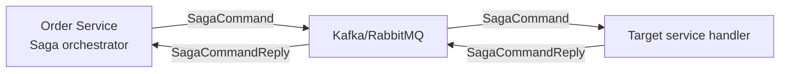

# Event-driven architecture

## Atlas notes

Atlas uses event-driven messaging primarily for cross-service coordination (Saga commands/replies) and
optionally for reliable publishing via the Outbox pattern.

### Messaging backends

- Kafka or RabbitMQ (selected by app-stack; see `backend/config/app-stack.*.yml`)
- Saga topics/exchanges follow a convention:
  - `saga.<sagaName>.command.<targetService>`
  - `saga.<sagaName>.commandreply`
  - `saga.<sagaName>.compensation.<targetService>`
  - `saga.<sagaName>.compensationreply`

### Outbox gateway (optional)

Publishing can be configured as:

- `app.messaging.gateway=instant` (default): publish directly
- `app.messaging.gateway=outbox`: persist message to `outbox_message` table, then relay via a scheduler

Relay runs periodically (implementation depends on included scheduler module) and processes
`OutboxMessageStatus.PENDING` entries until `PROCESSED` or `FAILED`.

https://blog.bytebytego.com/p/event-driven-architectural-patterns

---

## CQRS

https://levelup.gitconnected.com/system-architecture-high-throughput-reads-writes-in-databases-p2-44f92c2f383d

Command Query Responsibility Segregation (CQRS) architectures expand the concept of command-query division at the architectural level. But these architectures are not architectures of the whole software system. It is a design of just one part of the software and that part is called the Application Layer.

CQRS suggests dividing the Application Layer into two sides, the commands side, and the queries side.
1. The queries side should be responsible and optimized for reading data. Queries are reading data from persistence and then map them into the presentation layer required form. Such forms are mostly identified as Data Transfer Objects (DTOs).
2. The commands side should be responsible and optimized for writing data. Commands are executing use-cases, changing the states of entities, and saving them into persistence.

By separating read and write operations we increase the performance and support the Separation of Concerns principle in our systems.

There are three main types of CQRS architectures you can implement.

### Single Database CQRS

Single Database CQRS design has not a formal name, so Mattew Renze in his Pluralsight course Clean Architecture called it the Single Database CQRS and I will too.

As the name suggests, both sides are talking to a single database. Commands execute use-case in the domain which modifies the state of the entity. Then, the entity is saved into the database through ORM such as Entity Framework Core or Hibernate.

Queries are executed directly through the data access layer which is either ORM using projections like Linq to SQL or stored procedures.

### Two-database CQRS

In the Two-database approach, we have two dedicated databases, one for writing operations and one for reading operations. Commands side has Write Database optimized for writing operations. Query side has Read Database optimized for reading operations.

With every state changed by the command, the modified data has to be pushed from Write Database into the Read Database either as a single coordinated transaction across both databases or using the Eventual Consistency Pattern.

This architecture brings orders of magnitude improvements in performance on the queries side of the software and that is a good thing because the software users are generally spending more time with reading data than writing.

### Event-Sourcing CQRS

This is the most complex CQRS architecture. Event-sourcing is a whole different idea of storing the data than in two previously presented architectures.

In the Event-sourcing approach, we are not storing only the current state of entities, but we are storing every state that happened to the entity as snapshots. Entities are not saved as normalized data, but as their direct modifications with the timestamp of an event.

When we want to operate with the current state of the entity in the domain, we must construct such an entity first by applying each event on the entity.

Once we have the current entity, commands can modify it. Modifications will generate a new event that we will store in the Event Store. Therefore, we push the current state of the entity into a Read Database so reading can stay to be extremely fast.

Event-sourcing brings these benefits to the table:
- The event store is a complete audit trail that can come in handy in heavily regulated industries.
- We can reconstruct any state of any entity at any point in time. This is very useful for debugging.
- You can replay events to see what exactly happens in the system at any time. This feature is great for load testing and bug fixing.
- You can easily rebuild the production database.
- You can have more than one read optimized data store.

- Unfortunately, it is hard to implement and if you will not benefit from most of its features, it can be overkill.

---

## Event Sourcing
