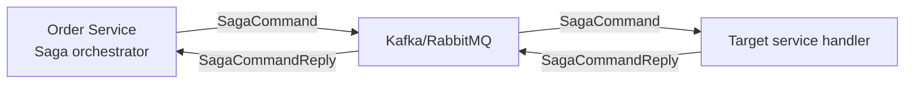

# Event-Driven Architecture: Comprehensive Technical Analysis

## Conceptual Foundation

Event-Driven Architecture (EDA) represents a paradigm shift from traditional request-response patterns to a decoupled, asynchronous communication model. This architectural style centers around the production, detection, consumption, and reaction to events—significant state changes or occurrences within a system.

### Core Principles and Theoretical Underpinnings

EDA is built upon several fundamental principles that differentiate it from synchronous architectures:

1. **Loose Coupling**: Producers and consumers operate independently without direct knowledge of each other
2. **Asynchronous Communication**: Events are processed asynchronously, enabling non-blocking operations
3. **Event Sourcing**: System state changes are captured as a sequence of immutable events
4. **Eventual Consistency**: Systems achieve consistency over time rather than immediately
5. **Scalability**: Horizontal scaling through distributed event processing

### Architectural Patterns in EDA

Event-Driven systems typically employ several key patterns:

| Pattern | Description | Technical Implementation |
|---------|-------------|--------------------------|
| **Event Notification** | Notifies consumers about state changes without containing full data | Lightweight messages with references to data sources |
| **Event-Carried State Transfer** | Events contain all necessary data for consumer processing | Self-contained messages with complete state information |
| **Event Sourcing** | System state is determined by replaying event sequences | Immutable event log as source of truth |
| **CQRS** | Separates command (write) and query (read) responsibilities | Distinct models for write and read operations |

## Atlas Implementation Notes

Atlas leverages event-driven messaging primarily for cross-service coordination through Saga patterns and optionally implements reliable publishing via the Outbox pattern for guaranteed message delivery.

### Messaging Backends: Technical Comparison and Selection Criteria

Atlas supports multiple messaging backends with selection determined by application stack configuration. The choice between Kafka and RabbitMQ involves significant architectural considerations:

#### Apache Kafka: High-Throughput Event Streaming

**Architectural Characteristics:**
- Distributed commit log architecture optimized for high-throughput streaming
- Persistent message storage with configurable retention policies
- Horizontal scalability through partitioning and consumer groups
- Strong ordering guarantees within partitions

**Technical Advantages:**
- Extremely high throughput (millions of messages per second)
- Built-in replication and fault tolerance
- Long-term message retention capabilities
- Excellent for event sourcing and stream processing

**Considerations:**
- Higher operational complexity and resource requirements
- Steeper learning curve for development and operations
- Better suited for high-volume, ordered event streams

#### RabbitMQ: Flexible Message Broker

**Architectural Characteristics:**
- Traditional message broker with exchange-based routing
- Multiple exchange types (direct, fanout, topic, headers)
- Flexible routing and message patterns
- Acknowledgment-based delivery guarantees

**Technical Advantages:**
- Lower operational complexity and resource footprint
- Flexible routing patterns and message transformations
- Better for complex routing scenarios and RPC patterns
- Mature management interface and monitoring tools

**Considerations:**
- Lower maximum throughput compared to Kafka
- Limited message retention capabilities
- Scaling requires clustering configuration

#### Comparative Analysis: Kafka vs RabbitMQ

| Feature | Apache Kafka | RabbitMQ |
|---------|--------------|----------|
| **Architecture** | Distributed log | Traditional broker |
| **Message Persistence** | Disk-based, long retention | Memory/disk, limited retention |
| **Throughput** | Very high (millions/sec) | High (hundreds of thousands/sec) |
| **Message Ordering** | Strong within partitions | Per-queue ordering |
| **Message Routing** | Topic-based partitioning | Flexible exchange patterns |
| **Delivery Guarantees** | At-least-once, exactly-once | At-least-once, at-most-once |
| **Scalability** | Horizontal partitioning | Vertical scaling or clustering |
| **Operational Complexity** | High | Moderate |
| **Use Case Fit** | Event streaming, log aggregation | Work queues, RPC, task distribution |

#### Saga Message Convention Patterns

Atlas implements a structured naming convention for saga-related messages:

- `saga.<sagaName>.command.<targetService>` - Commands for saga step execution
- `saga.<sagaName>.commandreply` - Responses from command execution
- `saga.<sagaName>.compensation.<targetService>` - Compensation commands for rollback
- `saga.<sagaName>.compensationreply` - Responses from compensation operations

This convention ensures consistent message routing and facilitates automated saga orchestration.



### Outbox Pattern: Reliable Message Delivery Implementation

The Outbox pattern addresses the fundamental challenge of reliable message delivery in distributed systems by ensuring atomicity between database transactions and message publishing.

#### Architectural Problem Statement

In traditional messaging approaches, applications face the dual-write problem:
1. Update database state
2. Publish corresponding event

If either operation fails independently, the system can enter an inconsistent state. The Outbox pattern solves this by treating message publishing as part of the database transaction.

#### Technical Implementation

Atlas provides two messaging gateway configurations:

**1. Instant Publishing (`app.messaging.gateway=instant`)**
- **Architecture**: Direct message publishing after database commit
- **Use Case**: Lower latency requirements, acceptable message loss scenarios
- **Trade-off**: Potential message loss if publishing fails after successful database commit
- **Technical Characteristics**:
  - Simple implementation with minimal overhead
  - Suitable for non-critical notifications and events
  - Requires idempotent consumer handling for potential duplicates

**2. Outbox Pattern (`app.messaging.gateway=outbox`)**
- **Architecture**: Two-phase approach with transactional safety
- **Use Case**: Critical business events requiring guaranteed delivery
- **Trade-off**: Increased latency due to periodic processing
- **Technical Implementation Details**:

```sql
-- Outbox table schema (simplified)
CREATE TABLE outbox_message (
    id BIGINT PRIMARY KEY AUTO_INCREMENT,
    aggregate_type VARCHAR(255) NOT NULL,
    aggregate_id VARCHAR(255) NOT NULL,
    message_type VARCHAR(255) NOT NULL,
    payload JSON NOT NULL,
    status ENUM('PENDING', 'PROCESSED', 'FAILED') DEFAULT 'PENDING',
    created_at TIMESTAMP DEFAULT CURRENT_TIMESTAMP,
    processed_at TIMESTAMP NULL,
    retry_count INT DEFAULT 0
);
```

#### Message Relay Process

The outbox relay operates through a scheduled process with the following characteristics:

1. **Transaction Scope**: Messages are written to the outbox table within the same database transaction as business data
2. **Relay Execution**: Scheduled job periodically processes `PENDING` messages
3. **Delivery Guarantees**: At-least-once delivery semantics with retry mechanisms
4. **Error Handling**: Failed messages are marked accordingly with retry counters
5. **Ordering Considerations**: Messages are typically processed in creation order within aggregate boundaries

#### Technical Benefits and Considerations

| Benefit | Technical Impact | Implementation Consideration |
|---------|------------------|----------------------------|
| **Transactional Safety** | Eliminates dual-write problem | Requires database transaction support |
| **Guaranteed Delivery** | Ensures event publication | Increases system complexity |
| **Decoupled Processing** | Separates business logic from messaging | Introduces eventual consistency |
| **Retry Capabilities** | Handles transient failures automatically | Requires idempotent message processing |
| **Monitoring** | Provides visibility into message pipeline | Adds operational overhead |

#### Performance and Scalability Considerations

- **Throughput**: Relay frequency and batch size should be tuned based on load
- **Latency**: Introduces delay between event occurrence and publication
- **Resource Usage**: Additional database operations for message storage and retrieval
- **Scalability**: Multiple relay instances can be used with proper coordination

The Outbox pattern represents the industry-standard solution for reliable event publication in microservices architectures, providing strong consistency guarantees while maintaining system reliability.

https://blog.bytebytego.com/p/event-driven-architectural-patterns

---

## CQRS

https://levelup.gitconnected.com/system-architecture-high-throughput-reads-writes-in-databases-p2-44f92c2f383d

Command Query Responsibility Segregation (CQRS) architectures expand the concept of command-query division at the architectural level. But these architectures are not architectures of the whole software system. It is a design of just one part of the software and that part is called the Application Layer.

CQRS suggests dividing the Application Layer into two sides, the commands side, and the queries side.
1. The queries side should be responsible and optimized for reading data. Queries are reading data from persistence and then map them into the presentation layer required form. Such forms are mostly identified as Data Transfer Objects (DTOs).
2. The commands side should be responsible and optimized for writing data. Commands are executing use-cases, changing the states of entities, and saving them into persistence.

By separating read and write operations we increase the performance and support the Separation of Concerns principle in our systems.

There are three main types of CQRS architectures you can implement.

### Single Database CQRS

Single Database CQRS design has not a formal name, so Mattew Renze in his Pluralsight course Clean Architecture called it the Single Database CQRS and I will too.


As the name suggests, both sides are talking to a single database. Commands execute use-case in the domain which modifies the state of the entity. Then, the entity is saved into the database through ORM such as Entity Framework Core or Hibernate.

Queries are executed directly through the data access layer which is either ORM using projections like Linq to SQL or stored procedures.

### Two-database CQRS

In the Two-database approach, we have two dedicated databases, one for writing operations and one for reading operations. Commands side has Write Database optimized for writing operations. Query side has Read Database optimized for reading operations.


With every state changed by the command, the modified data has to be pushed from Write Database into the Read Database either as a single coordinated transaction across both databases or using the Eventual Consistency Pattern.

This architecture brings orders of magnitude improvements in performance on the queries side of the software and that is a good thing because the software users are generally spending more time with reading data than writing.

### Event-Sourcing CQRS

This is the most complex CQRS architecture. Event-sourcing is a whole different idea of storing the data than in two previously presented architectures.

In the Event-sourcing approach, we are not storing only the current state of entities, but we are storing every state that happened to the entity as snapshots. Entities are not saved as normalized data, but as their direct modifications with the timestamp of an event.


When we want to operate with the current state of the entity in the domain, we must construct such an entity first by applying each event on the entity.

Once we have the current entity, commands can modify it. Modifications will generate a new event that we will store in the Event Store. Therefore, we push the current state of the entity into a Read Database so reading can stay to be extremely fast.

Event-sourcing brings these benefits to the table:
- The event store is a complete audit trail that can come in handy in heavily regulated industries.
- We can reconstruct any state of any entity at any point in time. This is very useful for debugging.
- You can replay events to see what exactly happens in the system at any time. This feature is great for load testing and bug fixing.
- You can easily rebuild the production database.
- You can have more than one read optimized data store.

- Unfortunately, it is hard to implement and if you will not benefit from most of its features, it can be overkill.

---

## Event Sourcing
