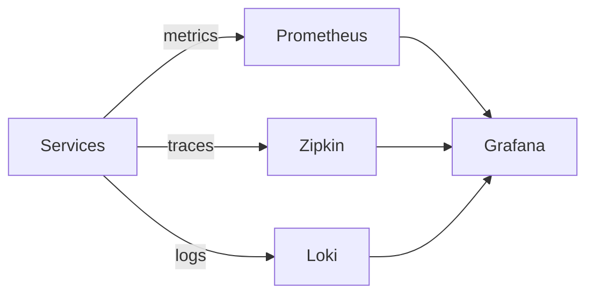

# Observability

## Atlas notes

Observability components are enabled via app-stack (`backend/config/app-stack.*.yml`) and wired in
Gradle through `libs/observability/*` modules.

App-stack switches:

- `observability.logging.stack`: `none` or `loki`
- `observability.logging.framework`: `logback`
- `observability.metrics`: `none` or `prometheus`
- `observability.tracing`: `none` or `zipkin`

Default Compose ports when enabled:

- Grafana: `http://localhost:3000`
- Prometheus: `http://localhost:9090`
- Zipkin: `http://localhost:9411`

### Service instrumentation

- Actuator base config is centralized in `libs/observability/actuator`
- Exposed endpoints include `health`, `info`, and `prometheus`
- Gateway additionally exposes `gateway`, `refresh`, and `routes`

### Operational tips

- Keep Prometheus scraping internal ports only
- Use Grafana dashboards from deployment templates as a baseline
- Prefer trace sampling in non-prod environments to control storage
