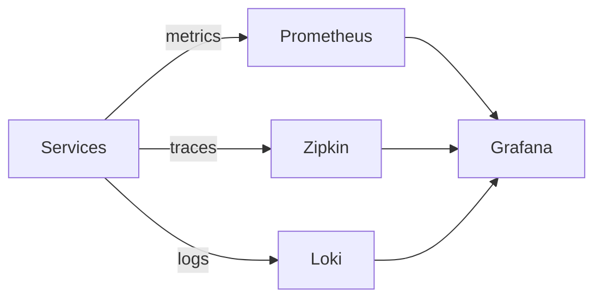

# Observability

## Atlas notes

Observability components are enabled via app-stack (`backend/config/app-stack.*.yml`).

Default Compose ports when enabled:

- Grafana: `http://localhost:3000`
- Prometheus: `http://localhost:9090`
- Zipkin: `http://localhost:9411`

https://levelup.gitconnected.com/system-design-concepts-prometheus-grafana-and-elk-eln-stack-c28274b26b15
https://levelup.gitconnected.com/system-design-concepts-hot-spot-detection-techniques-%EF%B8%8F-3ee1fc89de7a

## Tracing

https://netflixtechblog.com/building-netflixs-distributed-tracing-infrastructure-bb856c319304
