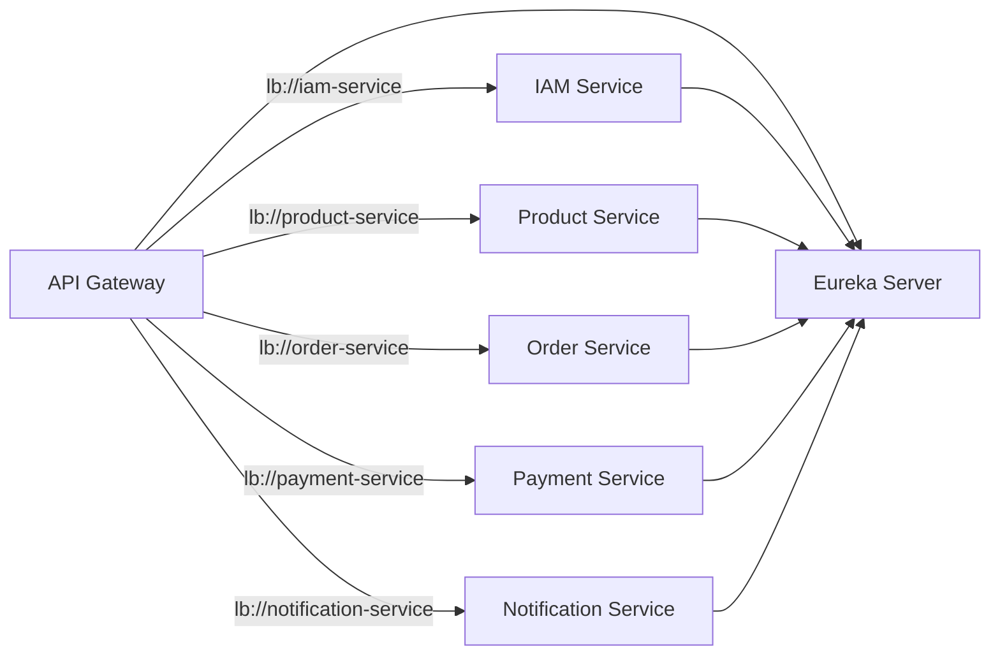

# Service discovery

## Atlas notes

Atlas uses Netflix Eureka as the discovery server and Spring Cloud’s service discovery integration.

Operationally:

- Eureka UI: `http://localhost:8761`
- Gateway can route using `lb://<service-id>` when discovery is enabled.

## Client-side discovery

In the client-side discovery pattern, each microservice will communicate with the discovery service directly. In this pattern, the service gets the network location of all other services and their instance location from the discovery service before making the request to the required service. After getting the locations, the calling service is supposed to have smartness in choosing the proper instance of the required service by implementing some load balancing algorithms. Netflix Eureka is a good example of using this pattern. Ribbon is another tool that works with Eureka and helps the service to efficiently choose an instance for load balancing the request.

The client-side discovery pattern is simple and easy to implement with so many available tools. As in self-registration, there is a violation of the microservice's basic single responsibility rule. Now, each service is also responsible for finding the location of other microservices in the network, and also with some algorithm, it should make a request to a particular service instance to balance the traffic load. Still, organization uses this pattern for ease of use.

---

## Server-side discovery

In the server-side discovery pattern, services will make a request to a single middleware entity, such as a load balancer or gateway. This gateway will communicate with the discovery service to locate the required service, and use logic to find the exact instance to talk with. The API gateway is supposed to have the logic of managing the traffic load and choosing the best instance of that particular service. It is aligned with a single responsibility rule for microservices. Microservices can focus on their business logic itself.
