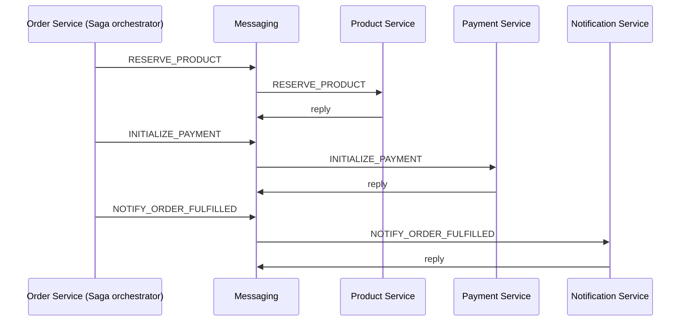

# System Design

## Atlas system design (repository-specific)

Atlas is organized as a poly-repo style mono-workspace:

- `backend/`: Java/Spring multi-module Gradle workspace (libs + services + platform)
- `frontend/`: Next.js app (React 19)
- `wiki/`: design notes and architecture docs

### Service landscape

```mermaid
flowchart LR
  FE[Frontend (Next.js :8000)] -->|HTTP| GW[API Gateway :8080]
  GW --> EUREKA[Eureka :8761]
  GW --> IAM[IAM :8081]
  GW --> PRD[Product :8082]
  GW --> ORD[Order :8083]
  GW --> PAY[Payment :8084]
  GW --> NOTIF[Notification :8085]

  subgraph Infra
    DB[(MySQL/Postgres)]
    REDIS[(Redis)]
    MQ[(Kafka/RabbitMQ)]
  end

  IAM --> DB
  PRD --> DB
  ORD --> DB
  PAY --> DB
  NOTIF --> DB

  IAM --> REDIS
  PRD --> REDIS
  ORD --> REDIS
  PAY --> REDIS
  NOTIF --> REDIS

  IAM --> MQ
  PRD --> MQ
  ORD --> MQ
  PAY --> MQ
  NOTIF --> MQ
```

### Deployment configuration (app-stack)

Local deployment is generated from an app-stack YAML file under `backend/config/` (example:
`app-stack.dev.yml`). This file selects concrete implementations for infra and cross-cutting concerns
(datasource, messaging, auth, storage, observability, etc.).

### Generated deployment (Compose/K8s)

`backend/deploy.sh` performs:

1. Read `backend/config/app-stack.<name>.yml`
2. Convert YAML -> `.cfg` format for the generator
3. Render templates (EJS) into `backend/dist/`
4. Execute the generated `install.sh`

### Checkout flow (Saga)

Checkout is implemented as an orchestrated saga (orchestrator in Order Service). Commands and replies are
exchanged via the configured messaging backend.



https://scalabrix.medium.com/list/system-design-concepts-for-interviews-7b12980141be

## Twelve-factor applications

The twelve-factor app is a collection of patterns for cloud-native application architectures, originally developed by engineers at Heroku. The patterns describe an application archetype that optimizes
for the “why” of cloud-native application architectures. They focus on speed, safety, and scale by emphasizing declarative configuration, stateless/shared-nothing processes that horizontally scale, and an overall loose coupling to the deployment environment. Cloud application platforms like Cloud Foundry, Heroku, and Amazon Elastic Beanstalk are optimized for deploying twelve-factor apps.

A twelve-factor app can be described in the following ways:

1. **Codebase**: Each deployable app is tracked as one codebase tracked in revision control. It may have many deployed instances across multiple environments.
2. **Dependencies**: An app explicitly declares and isolates dependencies via appropriate tooling (e.g., Maven, Bundler, NPM) rather than depending on implicitly realized dependencies in its deployment environment.
3. **Config**: Configuration, or anything that is likely to differ between deployment environments (e.g., development, staging, production) is injected via operating system-level environment variables.
4. **Backing services**: Backing services, such as databases or message brokers, are treated as attached resources and consumed identically across all environments.
5. **Build, release, run**: The stages of building a deployable app artifact, combining that artifact with configuration, and starting one or more processes from that artifact/configuration combination, are strictly separated.
6. **Processes**: The app executes as one or more stateless processes (e.g., master/workers) that share nothing. Any necessary state is externalized to backing services (cache, object store, etc.).
7. **Port binding**: The app is self-contained and exports any/all services via port binding (including HTTP).
8. **Concurrency**: Concurrency is usually accomplished by scaling out app processes horizontally (though processes may also multiplex work via internally managed threads if desired)
9. **Disposability**: Robustness is maximized via processes that start up quickly and shut down gracefully. These aspects allow for rapid elastic scaling, deployment of changes, and recovery from crashes.
10. **Dev/prod parity**: Continuous delivery and deployment are enabled by keeping development, staging, and production environments as similar as possible.
11. **Logs**: Rather than managing logfiles, treat logs as event streams, allowing the execution environment to collect, aggregate, index,  and analyze the events via centralized services.
12. **Admin processes**: Administrative or managements tasks, such as database migrations, are executed as one-off processes in environments identical to the app’s long-running processes.

---

## Use cases

https://medium.com/walmartglobaltech/building-a-24-7-365-walmart-scale-java-application-12cb7e58df9c
